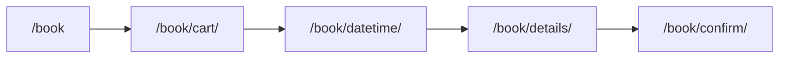
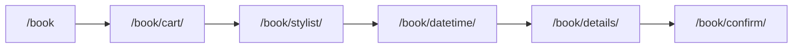

# Boulevard booking blueprint

Customer booking at `/book` mirrors the [Boulevard Client API booking guide](https://developers.joinblvd.com/2020-01/client-api/guides/booking-an-appointment) using our Supabase + Stripe stack.

## Flow mapping

| Boulevard step | SDK / API concept | Salon Citrine route | API / server |
| --- | --- | --- | --- |
| Location context | Business / location | `/book` (banner) | `GET /api/booking/cart` (default location) |
| Browse services | Categories + services | `/book` | Supabase `services` catalog |
| Build cart | `Cart.create` + `addBookableItem` | `/book/cart/` | `POST /api/booking/cart` |
| Select staff | Staff variant / bookable staff | `/book/stylist/` (any-pro path) | Staff catalog filters |
| Available dates | `getBookableDates` | `/book/datetime/` | `GET /api/availability/dates.json` |
| Available times | `getBookableTimes` | `/book/datetime/` | `GET /api/availability/slots.json` |
| Reserve slot | `reserveBookableItems` | Continue on datetime → details | `PATCH /api/booking/cart` (`action: reserve`) |
| Client identity | `cart.update` (client) | `/book/details/` | `GET /api/booking/clients/lookup.json` |
| Card on file | `addCardPaymentMethod` | `/book/details/` | `POST /api/booking/setup-intent` + Stripe Elements |
| Checkout | `checkout` | Submit on details | `POST /api/booking/appointments` |
| Confirmation | Appointment receipt | `/book/confirm/` | Email/SMS via notifications |

## Customer journey (two paths)

### Path A — stylist chosen on services page

Query params carry `services`, `stylist`, optional `cartId`, `startsAt`, `date`.

### Path B — any professional

`flow=stylist` is set after the professional step so the step indicator stays accurate.

## Cart reservation

- Created on datetime continue (`POST /api/booking/cart`).
- Slot held on continue (`PATCH /api/booking/cart`, `action: reserve`).
- `cartId` stored in session + passed to details and appointments API.
- Expiry shown on details page; expired holds return 409 on checkout.

## Key files

| Area | Path |
| --- | --- |
| URL helpers | `apps/web/src/lib/booking-flow.ts` |
| Cart server | `apps/web/src/lib/booking-cart.ts` |
| Cart client | `apps/web/src/scripts/booking-cart-client.ts` |
| Datetime reserve | `apps/web/src/scripts/datetime-booking.ts` |
| Details + pay | `apps/web/src/scripts/details-booking.ts` |
| Step UI | `apps/web/src/components/BookingSteps.astro` |
| DB parity | `packages/db/migrations/0024_boulevard_booking_parity.sql` |

## Manual test script

1. Open `/book` — confirm location banner and service list.
2. Pick a service with **Any Professional** → lands on `/book/cart/?services=…`.
3. Add an add-on if offered → **Choose a professional** → `/book/stylist/?services=…`.
4. Select a stylist → `/book/datetime/?services=…&stylist=…&flow=stylist`.
5. Pick date + time → **Continue** → `/book/details/?…&cartId=…` (reservation banner).
6. Enter email (returning client lookup fills fields) → card form loads → policy → confirm.
7. `/book/confirm/?appointment={id}` shows confirmation.

Repeat with a **pre-selected professional** on step 1 to skip `/book/stylist/`.

## Parity notes

| Feature | Status |
| --- | --- |
| Multi-service cart | Done |
| Staff variant | Done |
| Bookable dates/times shape | Done (`bookableDates`, `bookableTimes`) |
| Cart reservation + expiry | Done |
| Client lookup | Done |
| Waitlist | API only (`POST /api/booking/waitlist.json`) |
| Intake forms / service options | Schema + migrations; UI partial |
| Deposits at checkout | Stripe deposit on appointments API |
