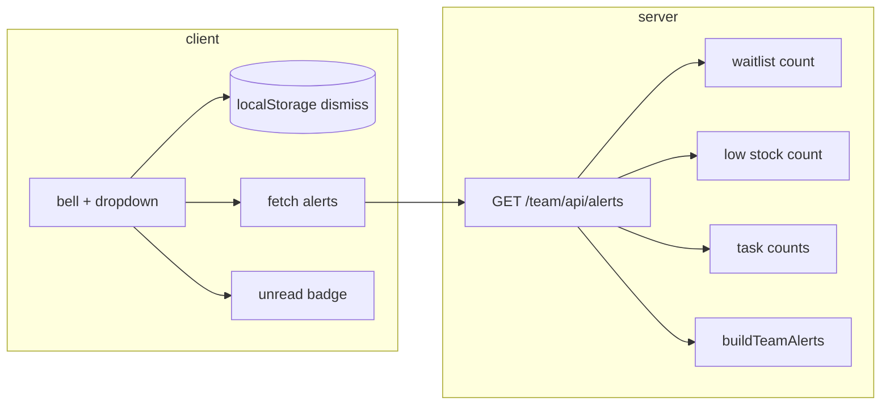

# Team Alerts v1 — Spec

> **Last updated:** July 7, 2026  
> **Owner:** Alerts swarm (Agent 1 — Architect)  
> **Related:** [UX_INTELLIGENCE_FEED.md](./UX_INTELLIGENCE_FEED.md) · [VISUAL_ELEVATION_NOTES.md](./VISUAL_ELEVATION_NOTES.md) · `apps/team/src/lib/alerts.ts` · `apps/team/src/lib/team-pulse.ts`

v1 ships a **computed notification feed** in the team header bell. No new Supabase tables, no push infra. Alerts are derived from data the app already loads (waitlist, inventory, tasks) and reuse Team Pulse query patterns.

---

## Goals

1. Replace the disabled bell in `TeamSiteHeader.astro` with a working dropdown (Agents 3–4).
2. Surface **actionable** salon signals staff already care about on the dashboard pulse.
3. Badge = **unread** actionable alerts (not raw row counts).
4. Dismiss/read state is **per-browser** via `localStorage` (v1). Resurfaces when the underlying count increases.

Non-goals for v1: per-user server dismiss, email/push, appointment-level alerts, Front Desk board events.

---

## Alert kinds (v1)

| Stable ID | Trigger | Visible to | Deep link | Severity |
| --- | --- | --- | --- | --- |
| `waitlist-active` | `waitlist_entries` with `status = active`, count > 0 | All staff | `/waitlist` | `info`; `warning` when count ≥ 3 |
| `low-stock` | Active products where `quantity ≤ reorder_threshold` and `reorder_threshold > 0`, count > 0 | All staff | `/inventory?lowStockOnly=1` | `warning` |
| `tasks-open` | `openPoolTasks + attentionTasks > 0` (see below) | Scoped per staff | `/tasks?view=available` or `/tasks?view=attention` | `urgent` when attention tasks > 0; else `info` |

### `tasks-open` count

Aligned with existing tasks API (`apps/team/src/pages/api/tasks/index.ts`):

- **`openPoolTasks`** — `tasks` where `assignment_type = 'open'` and `status = 'open'` (claimable by anyone).
- **`attentionTasks`** — `tasks` with `status IN ('open','claimed')`, non-null `due_at`, and `isTaskNeedsAttention(due_at, status)` (`TASK_ATTENTION_HOURS = 24` in `api-tasks.ts`), filtered to the current staff member:
  - Managers: all attention tasks.
  - Stylists: open-pool tasks **or** tasks where they are an assignee.

`tasks-open` is a **single aggregated alert** (one row in the dropdown) even when both sub-counts are > 0. Message copy reflects the mix; `href` prefers `view=attention` when attention tasks exist.

Alerts with `count === 0` are omitted from the API response.

---

## TypeScript contract

Canonical types and helpers live in `apps/team/src/lib/alerts.ts`:

- `TeamAlert`, `TeamAlertKind`, `TeamAlertSeverity`
- `AlertsResponse`, `AlertsSuccessResponse`, `AlertsErrorResponse`
- `TeamAlertMetrics` — input snapshot for builders
- `DismissedAlertsState`, `DismissedAlertRecord`
- Builders: `buildWaitlistAlert`, `buildLowStockAlert`, `buildTasksOpenAlert`, `buildTeamAlerts`
- Client dismiss: `loadDismissedAlerts`, `saveDismissedAlerts`, `dismissAlert`, `isAlertUnread`, `countUnreadAlerts`, `formatAlertBadgeCount`

---

## API

### `GET /team/api/alerts`

**Auth:** `requireApiAuth` from `api-calendar.ts` (same as waitlist/tasks/inventory).

**Response (200):**

```json
{
  "ok": true,
  "alerts": [
    {
      "id": "waitlist-active",
      "kind": "waitlist-active",
      "title": "Waitlist",
      "message": "2 waiting · book or reply",
      "count": 2,
      "href": "/waitlist",
      "severity": "info",
      "generatedAt": "2026-07-07T18:22:00.000Z"
    }
  ],
  "generatedAt": "2026-07-07T18:22:00.000Z",
  "scope": "salon"
}
```

**Errors:** `{ "ok": false, "error": "..." }` with `401` / `403` / `500` (same conventions as other team APIs).

**Implementation notes (Agent 2):**

- Reuse waitlist + low-stock queries from `loadTeamPulseMetrics` (`team-pulse.ts`).
- Add task counts using the same filters as `countAttentionTasks` + an open-pool count query (do not N+1 per task).
- Call `buildTeamAlerts(metrics)` before returning.
- `href` values are **paths relative to team base** — UI resolves with `teamUrl(alert.href)`.

### Dismiss — v1: `localStorage` only

**No `POST /team/api/alerts/dismiss` in v1.**

| Key | Value |
| --- | --- |
| `team-alerts-dismissed-v1` | JSON map `{ [alertKind]: { dismissedAt: ISO string, count: number } }` |

**Unread rule:** An alert is unread if it is absent from dismiss state **or** `alert.count > dismissed[kind].count`.

When a condition clears (`count` → 0), the alert disappears from the feed. If it returns later, it is unread again unless the user had dismissed at the same or higher count.

Optional v2: `POST /team/api/alerts/dismiss` with `{ kind, count }` stored per `staff_id` in Supabase.

---

## UI behavior (Agents 3–5)

### Bell button (`TeamSiteHeader.astro`)

- Remove `disabled`, `team-bar__icon-btn--muted`, and `title="Notifications unavailable"`.
- Keep existing layout and `team-bar__icon-btn` class — **no header redesign**.
- Attributes:
  - `aria-label` — `Notifications` or `Notifications, N unread` when badge > 0
  - `aria-haspopup="menu"`
  - `aria-expanded` / `aria-controls` — mirror desktop profile menu pattern in `team-header.ts`
  - `data-alerts-trigger` (suggested hook for Agent 4 script)

### Badge

- Small citrine pill on the bell icon; show `formatAlertBadgeCount(unreadCount)` (`1`–`9`, then `9+`).
- Hide badge when `unreadCount === 0`.
- `aria-hidden="true"` on the numeric badge; count is exposed via `aria-label` on the trigger.

### Dropdown panel

- Anchor under the bell, right-aligned (same positioning model as `team-bar__profile-menu`).
- Use theme tokens for panel surface: `--color-bg`, `--color-border`, `--color-text`, `--shadow-*` so dark mode matches profile menu.
- Bell/icon row stays on the **dark** `team-bar` (`--team-bar-*` tokens unchanged).

**List item anatomy:**

- Title (semibold), message (secondary), optional count chip.
- Primary action: navigate via `teamUrl(alert.href)` on row click.
- Secondary: “Dismiss” control per row (calls `dismissAlert` + `saveDismissedAlerts`, updates badge without reload).

**Empty state:** “You’re all caught up” + subtle subcopy (“No waitlist, stock, or task alerts right now.”).

**Loading:** Muted “Loading…” in panel on first fetch; do not block the bell click.

### Refresh

- Fetch `GET /team/api/alerts` on page load and when opening the panel.
- Optional: `document.visibilitychange` refresh when tab becomes visible (match network-status cadence if cheap).

### Keyboard & accessibility

Follow `initDesktopProfileMenu()` in `team-header.ts`:

| Key | Action |
| --- | --- |
| `Enter` / `Space` on trigger | Toggle panel |
| `Escape` | Close panel, return focus to trigger |
| `ArrowDown` / `ArrowUp` on trigger (closed) | Open panel, focus first/last item |
| `ArrowDown` / `ArrowUp` in panel | Move between items |
| `Tab` | Close panel (same as profile menu) |
| Click outside | Close panel |

- Panel: `role="menu"` or `role="listbox"` with items `role="menuitem"`.
- Only one of profile menu / alerts panel open at a time (close the other on open).

### Mobile (≤ 1100px)

- Bell remains in `team-bar__utilities` (beside account avatar button).
- Dropdown width `min(18rem, calc(100vw - 2rem))`; avoid clipping off-screen — flip/shift left if needed.
- Touch targets ≥ `--touch-target-min` (2.75rem) for rows and dismiss control.
- Do **not** move alerts into the account drawer for v1.

### Dark mode

- Panel uses `--color-bg` / `--color-text` (not `--team-bar-*`) — same split as profile dropdown.
- Unread row: optional `--color-citrine-muted` background or 2px left citrine accent (match sidebar active pattern from UX feed).
- Severity `urgent`: `--color-error` or dusty-rose accent on count chip only — no red bell icon.

---

## Data flow



---

## Agent handoff

| Agent | Scope |
| --- | --- |
| **1 (this doc)** | Spec + `alerts.ts` types/helpers |
| **2** | `GET /team/api/alerts` route |
| **3** | `TeamSiteHeader.astro` markup + styles for bell/badge/panel shell |
| **4** | `team-header.ts` (or `team-alerts.ts`) — fetch, dismiss, a11y |
| **5** | QA: auth, empty state, dark mode, mobile, count resurgence |

### Blockers / open questions

1. **Stylist low-stock visibility** — v1 shows `low-stock` to all authenticated staff (matches Team Pulse). Restrict to managers in v2 if needed.
2. **Polling** — no WebSocket; refresh on open + visibility is enough for v1.
3. **Cross-device dismiss** — localStorage only; expect badge to differ per device until v2 server dismiss.

---

## Verification checklist

- [x] Bell enabled; no “unavailable” tease ([VISUAL_ELEVATION_NOTES](./VISUAL_ELEVATION_NOTES.md))
- [x] Badge matches unread count, not total alerts
- [x] Dismiss hides alert until count rises
- [x] Each alert deep-links to the correct route with query params
- [x] `401` when logged out
- [x] Keyboard and screen reader parity with profile menu
- [x] Dark mode panel readable; bell row unchanged

---

## Shipped

**Date:** July 7, 2026  
**Integrator:** Alerts Agent 5 (QA, Polish & Ship)

### Delivered

- `GET /team/api/alerts` — waitlist, low-stock, and tasks-open aggregation
- `TeamAlertsPanel.astro` — dropdown shell, empty/loading/error states, dark-mode panel tokens
- `TeamSiteHeader.astro` — enabled bell with citrine badge (desktop + mobile utilities row)
- `team-alerts.ts` — fetch, count-based `localStorage` dismiss (`team-alerts-dismissed-v1`), badge, a11y
- `team-header.ts` — mutual exclusion with profile menu

### Deploy

Production Worker deployed from `apps/team` via `npx wrangler deploy --config dist-build/server/wrangler.json`.

- **URL:** https://salon-citrine-team.dbuszx.workers.dev
- **Version ID:** `d20c5b71-7ec1-43e5-b80e-d7142608cad9`
- **Commits:** `3e637d4` (spec/types) · `3c20abf` (API) · `ebeef3d` (panel) · `0095839` / `6f64f20` (header wire-up) · `e23c8ab` (integration polish)

### Known limitations (v2)

1. **Dismiss is per-browser** — `localStorage` only; badge differs across devices until server-side dismiss.
2. **No polling** — refresh on load, panel open, and tab visibility; no WebSocket push.
3. **Low-stock visible to all staff** — matches Team Pulse; manager-only filter deferred.
4. **No per-row dismiss button** — navigating a row marks it read; “Mark all read” clears the feed.
5. **No appointment-level alerts** — waitlist/stock/tasks only.
